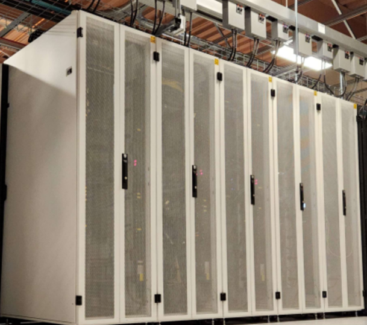

# Welcome to the University of Iowa HPC Documentation Site
<link rel="stylesheet" href="assets/stylesheets/images.css">

## Introduction

The University of Iowa supports researchers and their external collaborators by providing access to advanced supercomputing resources. Information Technology Services (ITS) operates several key systems, including the **Argon High Performance Computing (HPC) cluster**, the **Interactive Data Analytic Service (IDAS)**, and a variety of Storage Services.

In addition to the comprehensive [Argon wiki pages](https://uiowa.atlassian.net/wiki/spaces/hpcdocs/overview?homepageId=76513285), this site is designed to help users effectively utilize HPC resources for computational research projects. If you have any questions or feedback about the content of this site, please [contact us](mailto:research-computing@uiowa.edu). 

---

## News

-   :material-alert-box-outline:{ .lg .middle } __November 2025 Argon Maintenance__

    ---

    * The Fall 2025 maintenance will be from 8:00 AM on November 19th until 8:00 AM on November 20th

-   :material-update:{ .lg .middle } __Argon OS and Scheduler Update__

    ---

    * Cent OS7 to Rocky
    * SGE to SLURM

-   :material-school:{ .lg .middle } __Fall Semester 2025 Workshops__

    ---

    * Basic Linux 
    * Intro HPC
    
-   :material-database:{ .lg .middle } __Storage Modernization__

    ---

    * Large Scale Storage from zfs to Ceph

---

## Featured links for Research Services

  
  <a href="https://research.its.uiowa.edu/our-services/computing-services/argon-high-performance-computing-hpc" target="_blank">Argon: High-Perfmance Computing (HPC)</a>

 Accounts on the Argon HPC system are available at no cost to UI faculty, staff, and students who conduct research. Faculty members may sponsor access for research collaborators who are not part of the UI community and may purchase dedicated compute node capacity for their groups.

  
  <a href="https://idas.uiowa.edu/" target="_blank">Interactive Data Analytics Services (IDAS)</a>

 A high performance computing (HPC) resource that supports large-scale
and collaborative data analytics workflows involving RStudio, Jupyter Notebooks, and Jupyter Lab 

  
  <a href="https://research.its.uiowa.edu/our-services/storage-services" target="_blank">Storage Services</a>

 Store and share research data files 

  
  <a href="https://its.uiowa.edu/services/research-remote-desktop-service" target="_blank">Research Remote Desktop Service (RRDS)</a>

 A Windows virtual desktop environment through which users can remotely access research data and pre-installed analysis software. 

  
  <a href="https://uiowa.atlassian.net/wiki/spaces/hpcdocs/overview" target="_blank">Comprehensive Argon Manual at Wiki</a>

 Comprehensive information about how to utilize Argon cluster

---

## Acknowledgements

The Argon HPC cluster at the University of Iowa is a collaboration and as such there are different acknowledgements that may be appropriate for your citation. See our [guidelines](https://research.its.uiowa.edu/our-services/computing-services/argon-high-performance-computing-hpc/citationacknowledgement) for more details.

----
