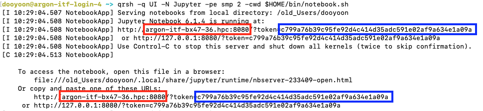

# Running a Jupyter Notebook on Argon

Although Argon is not designed to host a full JupyterHub installation, you can still run a **Jupyter Notebook** on Argon and connect to it using a web browser on your local machine. This requires setting up a network path, typically using **SSH tunneling**, between the system running the notebook (Argon) and your local computer.

To use a browser on your local machine, one end of the SSH tunnel must be on your computer.

The instructions below are specific to the Argon HPC system, including how to select a Python environment and run Jupyter.

!!! danger "Always run Jupyter Notebook on **compute nodes** using the SGE scheduler. Running it on login nodes can negatively impact system performance for others."

1. Create a Script to Launch Jupyter Notebook

    ```bash
    $ mkdir -p $HOME/bin
    $ echo -e '#!/bin/bash\njupyter notebook --ip=$(hostname -f) --no-browser --port=8080' > $HOME/bin/notebook.sh
    ```

    - This creates a directory for your personal scripts and adds a script to launch Jupyter Notebook.
    - The port number `8080` can be replaced with any available four-digit port.

    ```bash title="Contents of notebook.sh"
    #!/bin/bash
    jupyter notebook --ip=$(hostname -f) --no-browser --port=8080
    ```

2. Convert the script to be executable

    ```bash
    $ chmod +x $HOME/bin/notebook.sh
    ```

3. Load required modules 

    ```bash
    $ module load python
    $ module load py-jupyter
    ```
    !!! warning "important"
        The default Python version is 2.7, so you should load the Python module to use a later version of Python. Check the available Python versions by:
        ```bash
        $ module spider python
        ```
    
        You will need to load the required Python packages to use in the notebook. For example, 
        ```bash
        $ module load py-numpy
        $ module load py-matplotlib
        ```
    
        For more information, refer to the [Module page](../../modules#examples).

        Alternatively, you can activate a Python virtual environment or Conda virtual environment to build the list of packages you need. See [Python page](../python) for the detailed information. 


4. Launch Jupyter Notebook on a Compute Node

    Use the SGE scheduler to request compute resources:
    ```bash
    $ qrsh -q UI -N Jupyter -pe smp 2 -cwd $HOME/bin/notebook.sh
    ```

    In this example, it requests `UI` queue with 2 slots (`-pe smp 2`) and the name of the job is Jupyter. The `-cwd` flag indicates that the Jupyter Notebook will access the current directory. You can modify the queue, number of slots, and the Job name.

    If successful, you’ll see output like:

    

    In this example, it runs on `argon-itf-bx47-36.hpc` node with forwarding the port to `8080`. The token should be memorized to access the notebook in your local browser (the characters in the blue box above). 

    The port number is essentially a public address that anyone can use, even unintentionally (by typo, for example). The token is like a password; it only applies to the specific notebook running there (the one you launched just now), and it prints only in your specific terminal.

    !!! danger "Do not share the token with anyone."

    !!! tip "You can start the Jupyter Notebook in a [screen](https://uiowa.atlassian.net/wiki/spaces/hpcdocs/pages/76513460/Tips+for+Reducing+the+Number+of+Duo+Two-Factor+Logins#TipsforReducingtheNumberofDuoTwo-FactorLogins-LinuxScreen) or [tmux](https://uiowa.atlassian.net/wiki/spaces/hpcdocs/pages/76513460/Tips+for+Reducing+the+Number+of+Duo+Two-Factor+Logins#TipsforReducingtheNumberofDuoTwo-FactorLogins-TMUX) session so that you can detach the terminal. See Screen and Tmux for more information."


5. Set up an SSH Tunnel to Access a Remote Jupyter Notebook

    To access your Jupyter Notebook running on a remote machine, we’ll set up an SSH tunnel. This tunnel will forward traffic from a port on your local machine to the remote machine, allowing your browser to connect to the notebook as if it were running locally.

    By convention, most systems can refer to themselves using the hostname `localhost`, and we’ll follow that standard in this example.

    Web browsers typically attempt to connect to the default HTTP port (port 80). However, <mark> your Jupyter Notebook is running on a custom port on the remote system. To access it, we need to explicitly forward that port through SSH. </mark> Although the local and remote ports don’t need to match, using the same port number can simplify things—especially when using URLs generated by Jupyter Notebook.

    Open a new terminal session on your local workstation or laptop, and run the following command:

    ```bash
    $ ssh -N -L localhost:8080:argon-itf-bx47-36.hpc:8080 HawkID@argon.hpc.uiowa.edu
    ```

    That will configure a tunnel, from Local entry port `8080` on `localhost` (your system), to `argon-itf-bx47-36.hpc` node, with destination port `8080` (your notebook's port) through the login node. The destination compute node and the port should match what you set in the previous steps. 


    !!! tip "Once you complete the login process with Duo authentication, it will display nothing. However, you should not turn off this terminal while you are running the Jupyter Notebook. If this terminal is turned off accidentally, you can simply re-access it and continue to use the Jupyter Notebook."


6. Open the Notebook on your local browser

    Open a browser on your local computer and navigate to `http://localhost:8080`. 
    If prompted, you may need to enter a security token. Copy the token provided in Step 4 and paste it into the prompt to gain access.

!!! warning "Turn off the Notebook"

    Once you complete the job with the Jupyter Notebook, please stop the running of the notebook. You can do it by “Control-C” on the terminal that runs the notebook. You can check if it ends successfully by 

    ```bash
    $ jupyter notebook list
    ```
    where it will show the currently running notebook server if there is one. 

    Additionally, you need to check if this job with the notebook is done by
    ```bash
    $ qstat -u your_HawkID
    ```    
    Please do not keep the job alive when you are not practically using the Jupyter Notebook. 


<!--    -->

